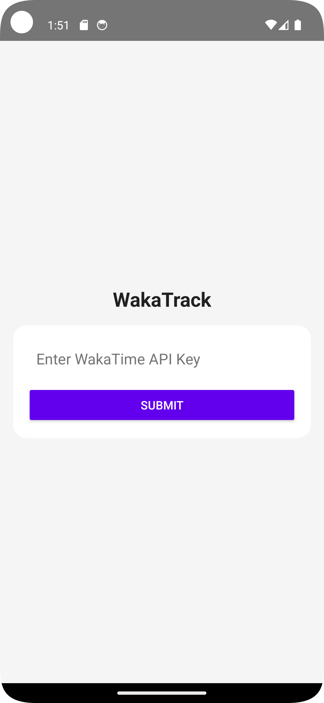
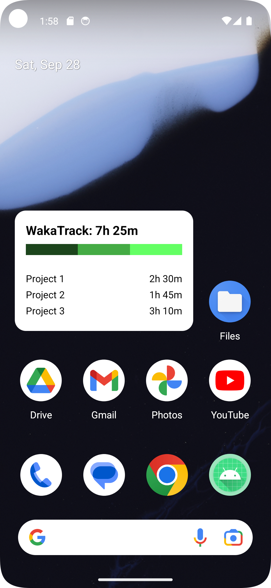
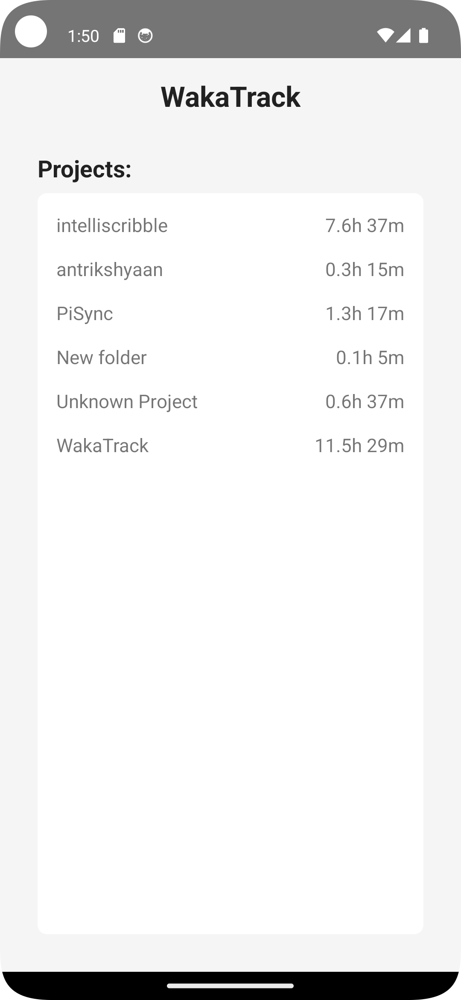
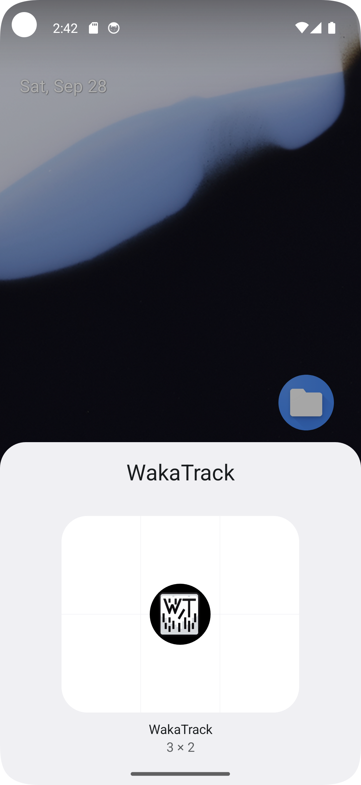

# WakaTrack

WakaTrack is an Android mobile application that allows users to track their daily time spent working on different projects, using data fetched from the WakaTime API. The app also features a home screen widget that displays the total time spent on projects and the time allocated to each project for the day. This helps users monitor their productivity and track progress directly from the home screen.

## Features

- **WakaTime API Integration**: Connect your WakaTime account by entering your API key and fetch data related to the time you spend on various projects.
- **Daily Tracking**: View the total time spent on projects for the current day.
- **Project Details**: See a breakdown of time spent on each project.
- **Progress Bar**: Visualize the time allocation on different projects through a color-coded progress bar.
- **Home Screen Widget**: View your daily time spent on various projects directly from your home screen.

## Release

Download the latest APK from the Releases section.

## Screenshots

| Home Screen | Home Screen Widget | Home Screen | Home Screen Widget |
|:-----------:|:------------------:|:-----------:|:------------------:|
|  |  |  |  |

## Installation

1. Clone the repository:
```

   git clone https://github.com/mukundsolanki/wakatrack.git

```
2. Open the project in Android Studio.
3. Build and run the project on an Android device or emulator.

## Usage

1. Enter API Key: On the home screen, input your WakaTime API key.
2. Fetch Projects: The app will fetch the project list from the past 7 days and display the time spent on each project.
3. Widget Setup: After setting up the widget, the home screen will display your daily time spent on all projects along with a detailed breakdown.

## Contributing

Feel free to open issues or submit pull requests if you'd like to contribute to the project.
